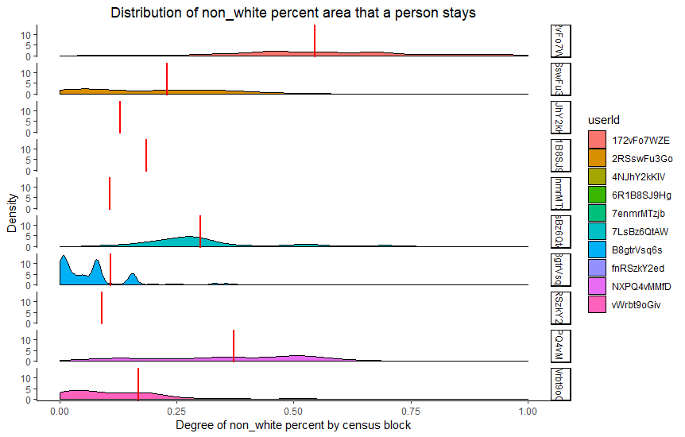
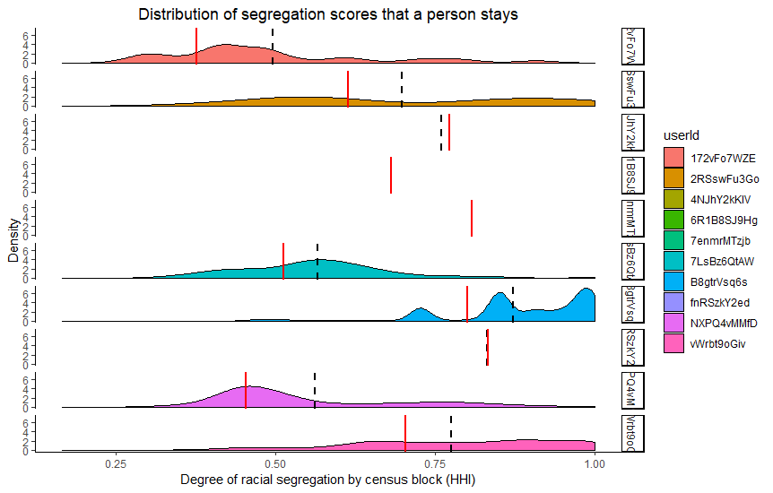

# Contextual measures of individual experience (racial and ethnic context)

# Introduction
Then, to examine individual's contextual experience, what measurement should we use? We need to start to find the answer of this question with theories of contextual effect. In other words, we need to consider the mechanism of contextual effect. Some scholars argues that the influx other races or outgroup increases racial threat and it affects people's negative attitudes (Giles and Buckner 1993; Key 1949). On the contrary, other scholars state that inter group interaction reduce stereotype and negative attitude towards outgroup (Oliver and Wong 2003; Welch et al. 2001; Cho and Baer 2011). These two different theories share a crucial point in that contact with other race or outgroup is the key to the mechanism. Therefore, when we consider the context and contact, we should consider how our daily lives and actual experience in micro level environment can be captured by our measurement. Then, with the individualized fine-grained contextual data, we can explore the contextual effect more accurately and more realistically. 

Therefore, in this paper, we used Milieu data which is based on people's actual GPS tracking record and Census block data to test the effect of context on racial resentment. We find that our measure of geographic context does not hold conventional level of statistical significance on racial resentment. We also test the same model with different measures of context (State, county and Census track), but the contextual effect is statistically unreliable. 

However, an interesting finding with the dynamic Milieu measure is that there is systematic mismeasurement of context among non-white respondents. The contextual measure of non-white are systematically distant from the contextual measure of white in terms of racial composition of Census block. It implies that the findings of contextual effect could not be well applied to racial minorities and the systematic mismeasurement could result bias in findings. Using an individual's Census tract as a proxy for social context performs better than the county and state measures. However, here too we see that this measure can under- or over-estimate the percentage of non-white people that an individual encounters. Indeed, Census tracts with a non-white population of around 30% align with dynamic block measures that put the non-white share of the population at nearly 60%.

# Project goals
1) Does individualized racial and ethnic experience (using dynamic measures of racial context) explain individuals' attitudes?
2) Develop new measures of raicial diverity exerience (e.g. using Herfindahl index(HHI)) and compare the measure with conventional static measure.

# Data
In order to create a dynamic measure of racial and ethnic context based on individual milieus, we rely on location data collected for over 400 users of a smartphone application, which automatically records users’ latitude and longitude based on Global Positioning System (GPS) hardware embedded in their mobile phones. Specifically, we obtain a sample of users of the OpenPaths application, developed and maintained by the Research and Development Lab at the New York Times Company. Our sample of OpenPaths users includes 2.6 million data points from 446 individuals. The number of GPS points for each individual range from 1 to over 111,000 with the median number of coordinate pairs being about 3,200. On average, we have about a year’s worth of geolocation for the individuals (364.4 days) with a maximum of over four years’ worth of data. The detailed information about the Milieu data can be found from [here](http://www.andrewreeves.org/papers/context.pdf).

 # Dependent variables
* Direct measure for racial attitudes: Racial Resentment, Views on the Confederate Flag, Views on Immigration Levels, Views on Whether People Can Be Trusted

* Inirect measure for racial attitudes: Whether New Prisons Should be Built, Views on buidling basketball

 # Independent variables
* Pct. Non-White (Dynamic measure)
* Pct. Non-White (Census Tract measure)
* Pct. Non-White (County measure)
* Pct. Non-White (State measure)
* Diversity measure (HHI measure)

# Racial experience measure: Pct. Non-White (Dynamic measure)

# Measurement for racial diversity (i.e. racial sergregation)

 
 

HHI can be maximized if individuals are evenly distributed among R groups. The higher HHI, the more diverse an area is. HHI varies from 0, where all neighborhoods have same composition as the entire city, to 1, where all neighbors have only one group.

